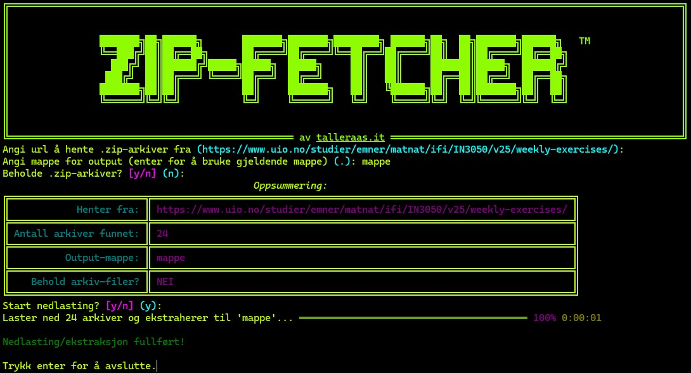

# ZIP-FETCHER

## Run example

Video of full run:

<<<<<<< HEAD

=======

<video width="320" height="240" controls>
  <source src="example/mappe_vid.mp4" type="video/mp4">
</video>
>>>>>>> 3850ff8efefc68b5a0fec22e823a4945c89739d0

Rich-powered TUI:

Resulting (sub)folders stored in specified directory:

