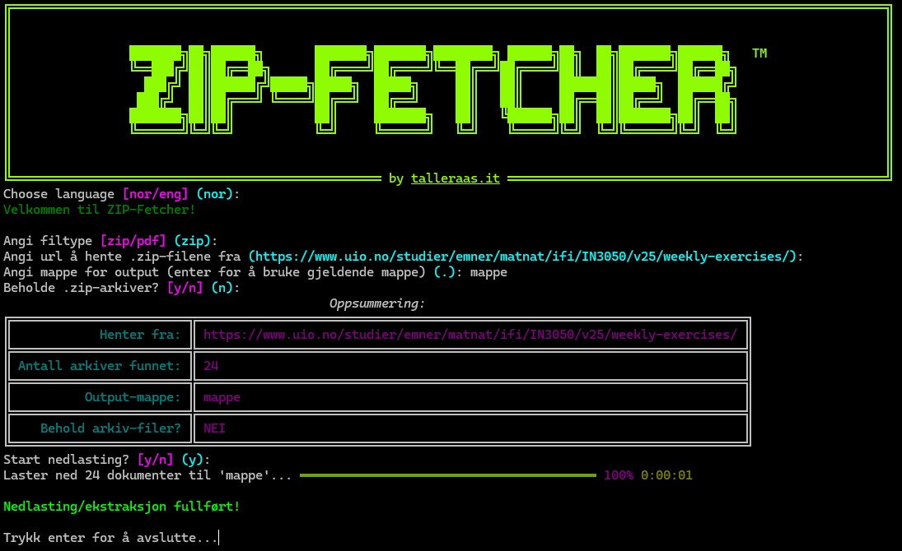
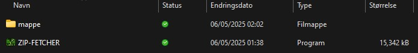

# ZIP-FETCHER

## Run example

Video of full run:

<video width="320" height="240" controls>
  <source src="example/mappe_vid.mp4" type="video/mp4">
</video>

Rich-powered TUI:

Resulting (sub)folders stored in specified directory:

